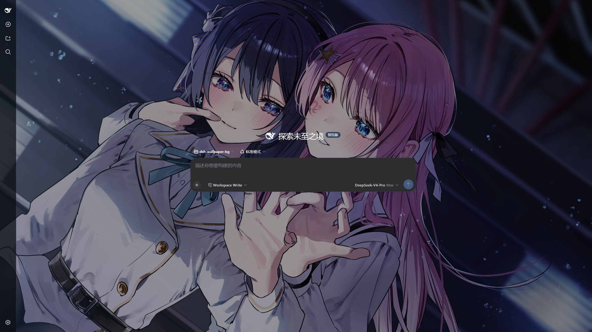
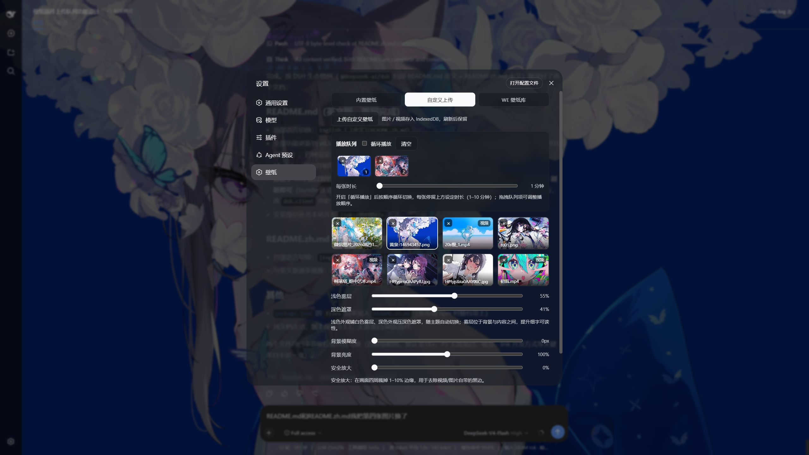
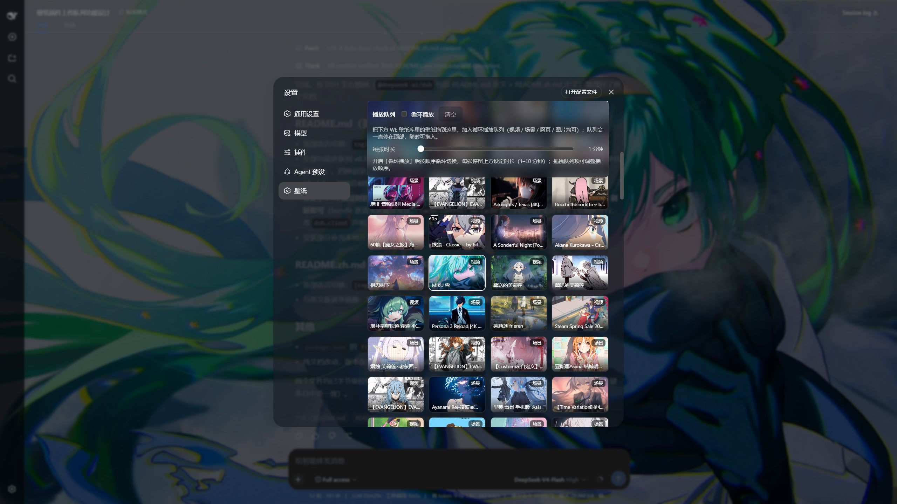

# dsh-wallpaper-bg

> v0.3.3 · MIT License

English | [中文](README.zh.md)

A static two-half plugin that puts an **independent animated wallpaper layer** under the [DeepSeek Harness](https://github.com/deepseek-ai/deepseek-harness) (DSH) web UI: one command to install, refresh the page, and the whole interface sits on a moving wallpaper. Ships with 10 high-res Unsplash images, supports uploading local images / videos, and can read-only connect to your local Wallpaper Engine library — video, scene (animated preview), and web wallpapers all come alive in the browser. In light theme a translucent white fog is layered in automatically, in dark theme a dimming overlay is applied, so fine text stays readable. The background layer is fully independent from the desktop Wallpaper Engine: changing wallpapers inside DSH never touches your desktop wallpaper, and vice versa.









## Features

- **Three wallpaper sources**
  - **Built-in wallpapers**: 10 high-res Unsplash images, ready to use with zero local services;
  - **Custom uploads**: local images / videos, stored in IndexedDB and kept across refreshes. Videos get auto-generated first-frame thumbnails, and extension-based detection covers files whose MIME type the browser leaves empty (e.g. `.mkv` / `.mov`) — they now render as video instead of a black screen;
  - **WE library**: read-only access to locally installed Wallpaper Engine wallpapers (default `http://127.0.0.1:8088`), filtered by the real Steam subscription list — unsubscribed wallpapers never linger.
- **Playback queue (custom uploads + WE library)**: drag wallpapers from either source's grid into its queue and loop-play them, 1–10 minutes per item (both queues share one duration slider). Queue items support drag-to-reorder (with an insertion indicator), click-to-jump, per-item remove, and clear-all; queue contents, toggles and playback positions persist to localStorage. The custom queue accepts images / videos; the WE queue accepts video / scene / web / image wallpapers. Each queue is **sticky at the top of its tab**, so even with hundreds of wallpapers any tile is a short drag away.
- **Four render modes**
  - Static images (cover-fit);
  - Videos (canvas rendering, 30 FPS cap, no letterboxing or distortion);
  - Scenes (WE official preview: full-screen looping `preview.gif` when present, static `preview.jpg` otherwise);
  - Web wallpapers (native iframe rendering of `index.html` in the browser).
- **Five adjustments**: light fog / dark overlay (auto-switching with the DSH theme), background blur (0–20px), background brightness (50–150%), safe zoom (0–10% to crop edge letterboxing).
- **View-only source tabs**: switching between 内置壁纸 / 自定义上传 / WE 壁纸库 only changes what the panel shows — the background stays untouched until you explicitly click a wallpaper, operate a queue, or enable 同步桌面壁纸 (which mutually excludes the WE queue).
- **Sync desktop wallpaper** toggle: read-only follow of the current WE desktop wallpaper (30-second polling).
- WE library filters: type (all / video / scene / web) + rating (all / safe / 18+; 18+ cards carry a red badge with live counts). The rating filter resets to **safe** every time the WE tab is opened.
- Settings persist to localStorage; the UI surface auto-turns semi-transparent to reveal the background.

## Installation

### Prerequisites

- Windows / macOS / Linux with Node.js ≥ 20 (`node -v`);
- A working DeepSeek Harness with `dsh web` running;
- Only the WE library source needs Windows + a local Wallpaper Engine install (optional, see below).

### Install via the official dsh command

```bash
dsh plugin --profile web add dsh-wallpaper-bg
```

> For local development from a checkout, link the repo instead:
> `dsh plugin --profile web add link:<absolute-path-to-repo>` — subsequent `lib/client.js` edits apply after a plain page refresh (no server restart).

### Optional: WE library service (Windows)

The WE library source needs the `wallpaper-engine-api/` service, which exposes the installed Wallpaper Engine list as a read-only HTTP API on `127.0.0.1:8088`:

1. `cd wallpaper-engine-api && npm install`;
2. Double-click `启动服务.bat` (the first run asks for the WE install path; `启动服务-静默.vbs` starts it silently);
3. Optional: double-click `设置开机自启.bat` to register the silent starter in the registry (`HKCU\...\Run`) so it starts at login; `取消开机自启.bat` removes it (the scripts reference `启动服务-静默.vbs` in this directory — re-run them after moving the folder);
4. For upgrades / restarts always double-click `重启服务(管理员).bat`: it requests admin rights, stops the old process, restarts silently and waits for the port (full log: `restart-debug.log`).

The service is **read-only**: it only queries the list / current wallpaper, never touches settings or playback, and never launches WE when the runtime is absent. The list is filtered by the real Steam subscription manifest (`431960_subscriptions.vdf`) — unsubscribed or locally disabled wallpapers disappear even if their folders linger, matching the WE UI.

> Verify: open `http://127.0.0.1:8088/health` in a browser — a JSON response means it is up; the plugin side reports its own version at `http://127.0.0.1:3080/dsh-wallpaper-bg/health`. Port 8088 is a historical choice (8080 was once taken by Jenkins); switch ports via the `WEAPI_PORT` env var and update the base URL in the plugin settings.

## Settings panel

| Item | Description |
| --- | --- |
| Built-in / Custom upload / WE library | Source tabs: switching tabs only changes the panel view; the background applies only on explicit selection (click a wallpaper, queue actions, or sync desktop) |
| Upload custom wallpapers | Images / videos, stored in IndexedDB; videos get auto-generated first-frame thumbnails |
| Playback queue | Independent queue per source, sticky at the top of its tab: drag wallpapers in, loop-play at 1–10 min per item (shared duration slider), drag-to-reorder, click-to-jump, × to remove, clear to reset |
| WE base URL + refresh | WE API address (default `http://127.0.0.1:8088`) |
| Type filter | all / video / scene / web, by the wallpaper's real type |
| Rating filter | all / safe / 18+ (from `contentrating` in project.json: 18+ = Mature + Questionable), 18+ cards carry a red badge with live counts; resets to **safe** every time the WE tab is entered |
| Sync desktop wallpaper | Read-only follow of the current WE desktop wallpaper (mutually exclusive with the WE queue) |
| Light fog / dark overlay | 0–100%, auto-switching with the DSH theme: translucent white fog in light theme to lift fine text, dark overlay in dark theme |
| Background blur / brightness | 0–20px / 50–150% |
| Safe zoom | 0–10% scale-up to crop edge letterboxing |
| Reset to defaults | One-click restore of all settings |

## How it works

This package is a DSH **static two-half plugin**, composed into the DSH host plane as a **profile bundle layer**:

| Half | File | Responsibility |
| --- | --- | --- |
| Host half (Node) | `lib/host.js` | Registers same-origin routes: `/dsh-wallpaper-bg/asset` (streaming local-file proxy with Range support), `/dsh-wallpaper-bg/we` (read-only WE API proxy with caching), `/dsh-wallpaper-bg/health` |
| Browser half | `lib/client.js` | Single-file client bundle (`window.__ModuleLoader__` factory form): injects the background layer and overlay, registers the 壁纸 settings tab |
| Composition | `cordis.patch.yml` | `dsh.bundle` patch: inserts the plugin row into the profile composition's host plane — active on `dsh web` startup, the first page load already carries the background |

Zero build on both ends: `lib/client.js` is a hand-written single-file bundle, no bundler required; a `dsh-wallpaper-bg` CLI (`install` / `status` / `uninstall`) provides one-command setup.

## FAQ

- **Scene wallpapers don't move?** WE scene wallpapers are compiled `scene.pkg` bytecode (scene logic, shaders, particles) that only WE's own engine can render — the browser can't execute them, and that's a hard browser limit every plugin shares. The plugin shows WE's official preview instead: full-screen looping `preview.gif` when present, static `preview.jpg` otherwise. **For full fidelity**: use WE's tray-menu screen recorder (or OBS) to record ~30 seconds of the scene to MP4, upload it via custom uploads, and it plays 100% faithfully in the browser.
- **Do web-type wallpapers render?** Yes — web wallpapers are plain HTML/JS pages, rendered natively in a full-screen iframe (`index.html` plus relative assets, served read-only by the WE API's `/files/<id>/...` route, restricted to subscribed wallpaper directories). Note the background layer never intercepts the mouse, so the wallpaper's own interactions (click / drag) don't work — visual only; audio visualizers relying on WE's private JS API may stay silent.
- **Videos have black bars?** Pull 安全放大 (safe zoom) to 2–3% to crop the video's own letterboxing (the cover-crop render already guarantees no self-made bars).
- **My uploaded video shows a black screen / black tile?** Videos whose MIME type the browser leaves empty (common for `.mkv` / `.mov`) are now detected by extension and rendered as video; every video upload also gets an auto-generated first-frame thumbnail. If a specific file is still black, its codec is likely unsupported by the browser.
- **Code changes don't take effect?** For `lib/client.js` / `lib/host.js` content edits, a plain page refresh (F5) is enough — client bundles are read fresh from disk per request (`cache-control: no-cache`), so no server restart is required. A DSH restart is only needed when the plugin set changes (adding / removing plugin rows or editing `dsh.client` declarations).
- **WE library errors?** Confirm the `wallpaper-engine-api` service is running on port 8088 (`http://127.0.0.1:8088/health` in a browser) and the base URL in plugin settings matches.
- **Wallpapers removed in WE still show up?** The service filters by the Steam subscription list, so unsubscribed wallpapers disappear; if the service is outdated (`/health` lacks the `subscriptionsFile` field), double-click `重启服务(管理员).bat` to upgrade, then click 刷新 in the plugin.

## License

MIT License, see [LICENSE](LICENSE). Issues / PRs welcome.

`legacy/` holds the pre-v0.1.0 dynamic-plugin (Cordis dynamic package) source, archived for reference only.
