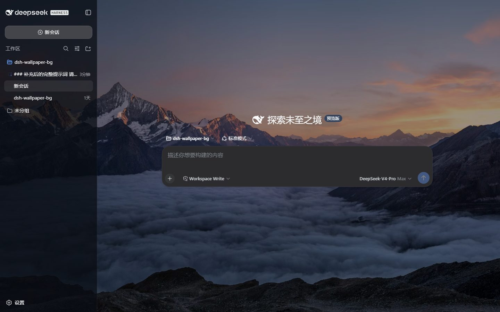
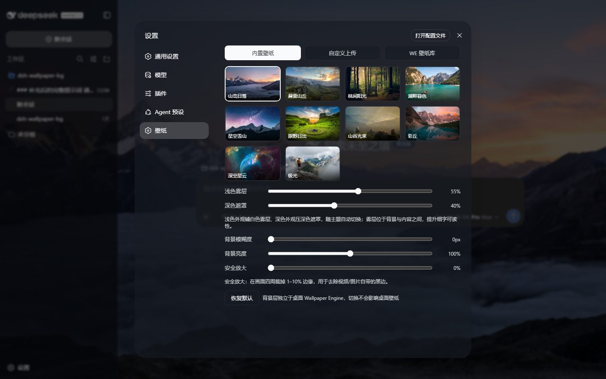
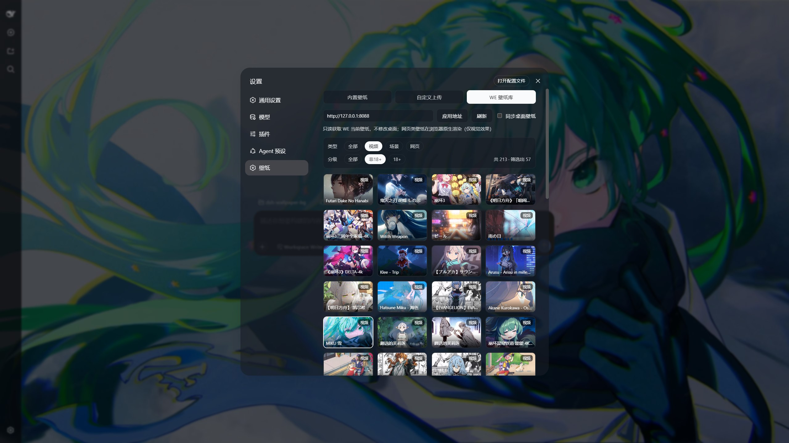

# dsh-wallpaper-bg

> v0.2.5 · MIT License

给 [DeepSeek Harness](https://github.com/deepseek-ai/deepseek-harness)（DSH）网页界面加上一层**独立的动态壁纸背景**的静态双半插件：一条命令装好、刷新页面，整个界面的底层就变成一张会动的壁纸。内置 10 张 Unsplash 高清图，支持本地自定义图片 / 视频上传，还能只读接入本机 Wallpaper Engine 壁纸库——视频、场景（动图预览）、网页三类壁纸都能在浏览器里动起来；浅色外观自动铺半透明白雾、深色外观自动压暗遮罩，保证界面细字始终清晰。背景层与桌面 Wallpaper Engine 完全独立：在 DSH 里换壁纸不会动你的桌面壁纸，反之亦然。








## 功能

- **三种壁纸来源**
  - **内置壁纸**：10 张 Unsplash 高清图，即装即用，无需任何本地服务；
  - **自定义上传**：本地图片 / 视频，存入 IndexedDB，刷新后保留；
  - **WE 壁纸库**：只读接入本机 Wallpaper Engine 已安装壁纸（默认 `http://127.0.0.1:8088`），并按 Steam 真实订阅清单过滤——在 WE 里退订的壁纸不会残留。
- **四种渲染**
  - 静态图片（cover 铺满）；
  - 视频（canvas 渲染、30 FPS 上限、无黑边无变形）；
  - 场景（WE 官方预览：有 `preview.gif` 就全屏循环动画，只有 `preview.jpg` 就静态展示）；
  - 网页（web 类型壁纸 iframe 原生渲染 `index.html`，浏览器里真跑起来）。
- **五项调节**：浅色雾层 / 深色遮罩（随 DSH 主题自动切换）、背景模糊度（0–20px）、背景亮度（50–150%）、安全放大（0–10%，裁掉边缘黑边）。
- **同步桌面壁纸**开关：只读跟随 WE 当前桌面壁纸（30 秒轮询）。
- WE 库内筛选：类型（全部 / 视频 / 场景 / 网页）+ 分级（非18+ / 18+，18+ 卡片带红色角标，实时显示计数）。
- 设置持久化到 localStorage；界面表面自动半透明化以透出背景。

## 安装

### 前提条件

- Windows / macOS / Linux，Node.js ≥ 20（`node -v` 检查）；
- 已装好 DeepSeek Harness，且能用 `dsh web` 正常启动网页界面；
- 仅「WE 壁纸库」来源需要 Windows + 本机 Wallpaper Engine（可选组件，见下文）。

### 方式一：CLI 一键安装（推荐）

```bash
# 1. 全局安装插件包，把 dsh-wallpaper-bg 命令放进 PATH
npm install -g dsh-wallpaper-bg

# 2. 一键安装（幂等，可重复执行）
dsh-wallpaper-bg install
```

`install` 自动完成以下事情，全程无需手改文件：

1. **解析链检查**：用与 DSH 一致的 ESM 方式，从 harness 锚点（组合文件目录向上走 `node_modules` 链）探测插件能否被解析；
2. 解析不到时，在 `%USERPROFILE%\.dsh\node_modules` 建指向本包的 junction（Windows）/ 符号链接（macOS / Linux）；
3. **写入 profile 补丁层** `profiles/<name>/cordis.patch.yml`（用户自有补丁层，带管理标记，`uninstall` 可干净移除）。

装完**刷新页面即可看到壁纸背景**；之后每次 `dsh web` 启动、首次加载页面即生效——无需会话、无需预设、无需重启。

其它命令：

```bash
dsh-wallpaper-bg status      # 查看安装状态（锚点、补丁层、服务端口）
dsh-wallpaper-bg uninstall   # 卸载；若补丁层只剩注释/空白会自动恢复为模板，不会留下让 dsh web 启动失败的空文件
```

> 本地开发 / 源码安装：`npm install -g <仓库路径>` 再执行 `install` 即可——junction 指向仓库，改代码即改插件（改完重启 `dsh web` 生效）。

### 方式二：官方 dsh 命令

```bash
dsh plugin --profile web add dsh-wallpaper-bg
```

> 本地路径含空格时 `dsh plugin` 的参数转发会被拆断，请用裸包名（npm 发布版）。

### 方式三：预设行模式（按会话开关壁纸）

想按会话开关壁纸（而不是全局常驻）时：

```bash
dsh-wallpaper-bg install --preset
```

会复制 `standard` 预设为 `standard-wallpaper` 并追加插件行；重启 DSH 后新建会话选择该预设即可。也可以手动在任一预设的 `agent.cordis.yml` 末尾追加：

```yaml
- id: wallpaper-bg
  name: dsh-wallpaper-bg
  config:
    weBase: http://127.0.0.1:8088
```

> 拿不准锚点时：`dsh-wallpaper-bg status` 直接给出结论；手动排障则把启动报错里的 `imported from <目录>` 抄出来，把插件装进该目录链上的 `node_modules` 即可。

### 可选组件：WE 壁纸库服务（Windows）

「WE 壁纸库」来源需要 `wallpaper-engine-api/` 服务，它把 Wallpaper Engine 已安装壁纸列表以只读 HTTP API 暴露在 `127.0.0.1:8088`：

1. 进入 `wallpaper-engine-api/` 目录，执行 `npm install`；
2. 双击 `启动服务.bat`（首次运行会引导写入安装路径；也可用 `启动服务-静默.vbs` 静默启动）；
3. 可选：双击 `设置开机自启.bat`，把静默启动脚本注册到注册表（`HKCU\...\Run`），登录 Windows 时后台自动启动；取消请双击 `取消开机自启.bat`（脚本直接引用本目录的 `启动服务-静默.vbs`，移动过目录后请重新设置一次）；
4. 之后升级 / 重启服务一律双击 `重启服务(管理员).bat`：自动请求管理员权限、结束旧进程并静默重启，等待端口就绪（全程日志见 `restart-debug.log`）。

服务**只读**：仅调用列表 / 当前壁纸查询，绝不触碰设置或播放接口；未检测到 WE 运行时也不会拉起 WE 主程序。列表按 Steam 真实订阅清单（`431960_subscriptions.vdf`）过滤——在 WE 里退订 / 本地禁用的壁纸即使文件夹残留也不会再出现，与 WE 界面一致。

> 验证：浏览器打开 `http://127.0.0.1:8088/health` 返回 JSON 即正常；插件侧打开 `http://127.0.0.1:3080/dsh-wallpaper-bg/health` 可看插件版本。端口 8088 是历史选择（8080 曾被 Jenkins 占用）；换端口用环境变量 `WEAPI_PORT`，并在插件设置面板里把基地址改成对应值。

## 设置面板说明

| 项 | 说明 |
| --- | --- |
| 内置壁纸 / 自定义上传 / WE 壁纸库 | 来源切换（每行 4 张缩略图） |
| 上传自定义壁纸 | 图片 / 视频，存入 IndexedDB |
| WE 基地址 + 刷新 | WE API 地址（默认 `http://127.0.0.1:8088`） |
| 类型筛选 | 全部 / 视频 / 场景 / 网页，按壁纸真实类型过滤 WE 壁纸库 |
| 分级筛选 | 全部 / 非18+ / 18+（基于 project.json 的 `contentrating`：18+ = Mature + Questionable），18+ 卡片带红色角标，面板实时显示筛选计数 |
| 同步桌面壁纸 | 只读跟随 WE 当前桌面壁纸 |
| 浅色雾层 / 深色遮罩 | 0–100%，随 DSH 主题自动切换：浅色外观铺半透明白雾垫在内容下方提升细字可读性，深色外观压黑遮罩 |
| 背景模糊度 / 背景亮度 | 0–20px / 50–150% |
| 安全放大 | 0–10%，按比例放大背景以裁掉边缘黑边 |
| 恢复默认 | 一键重置全部设置 |

## 原理

本包是 DSH **静态双半插件**，并作为 **profile 补丁层（bundle）**组合进 DSH 的 host 平面：

| 半边 | 文件 | 职责 |
| --- | --- | --- |
| 宿主半（Node） | `lib/host.js` | 注册同源路由：`/dsh-wallpaper-bg/asset`（本地文件流式代理，支持 Range）、`/dsh-wallpaper-bg/we`（WE API 只读代理，带缓存）、`/dsh-wallpaper-bg/health` |
| 浏览器半 | `lib/client.js` | 单文件 client bundle（`window.__ModuleLoader__` 工厂形式），注入背景层与遮罩、注册设置面板「壁纸」选项卡 |
| 组合层 | `cordis.patch.yml` | `dsh.bundle` 补丁：把插件行插入 profile 组合的 host 平面，**随 `dsh web` 启动即生效**，首次加载页面就带背景 |

两端零构建：`lib/client.js` 是手写的单文件 bundle，无需任何打包工具；另附 `dsh-wallpaper-bg` CLI（`install` / `status` / `uninstall`）完成一键安装。

## 常见问题

- **场景类壁纸不动？** WE 场景壁纸是 `scene.pkg` 编译字节码（场景逻辑、shader、粒子系统都在里面），只有 WE 自己的引擎能渲染，浏览器无法执行——这是纯浏览器的上限，任何插件都一样。插件会显示 WE 官方预生成的预览：有 `preview.gif` 就全屏循环播放动画，只有 `preview.jpg` 就只能显示静态图。**想要完整特效**：用 WE 托盘菜单的屏幕录制（或 OBS）把该场景录 30 秒左右导出成 MP4，再通过「自定义上传」传进来，浏览器里就是 100% 保真的动态壁纸。
- **网页类壁纸（web 类型）能正常显示吗？** 能——web 壁纸本来就是 HTML/JS 网页，插件会用 iframe 全屏原生渲染 `index.html` 及其相对资源（由 WE API 的 `/files/<id>/...` 目录路由只读提供，仅限已订阅壁纸目录）。注意：背景层不拦截鼠标，所以壁纸的鼠标交互（点击、拖拽）不会生效，仅视觉效果；依赖 WE 私有 JS 接口的音频可视化可能不发声。
- **视频有黑边？** 用「安全放大」拉 2–3% 即可裁掉画面自带的黑边（渲染层的 cover 裁剪已保证不自造黑边）。
- **改了代码不生效？** 改 `lib/client.js` 或 `lib/host.js` 后重启 DSH（客户端 bundle 按内容哈希进 boot graph，新增/移除插件行需要重启）。
- **WE 壁纸库报错？** 确认 `wallpaper-engine-api` 服务在 8088 端口运行（浏览器访问 `http://127.0.0.1:8088/health` 验证），且插件设置里的基地址一致。
- **在 WE 里删掉的壁纸还在插件里？** 服务会按 Steam 订阅清单过滤，退订的壁纸不再列出；若服务还是旧版本（`/health` 没有 `subscriptionsFile` 字段），双击 `重启服务(管理员).bat` 升级，然后点插件里的「刷新」。

## 开源

MIT License，见 [LICENSE](LICENSE)。欢迎 issue / PR。

`legacy/` 目录存放 v0.1.0 之前的动态插件（Cordis dynamic package）时代源码，仅作归档。
