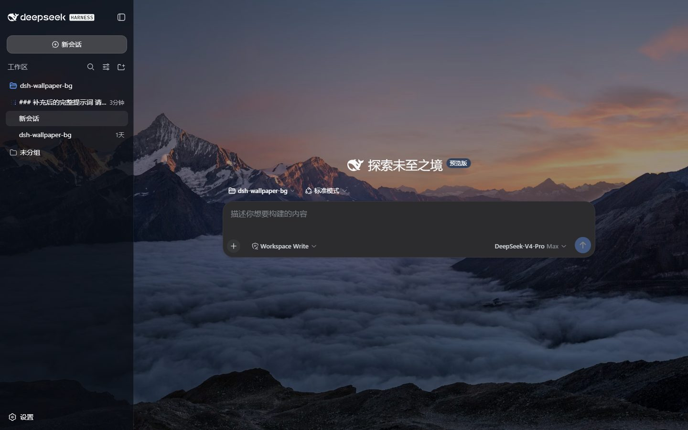
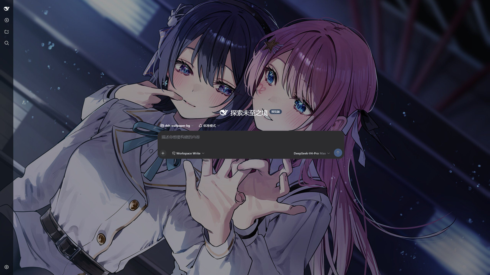
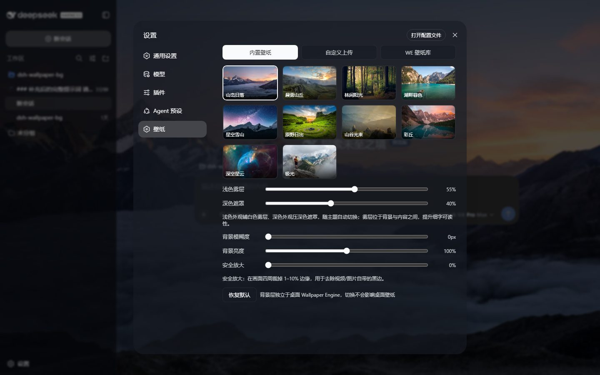
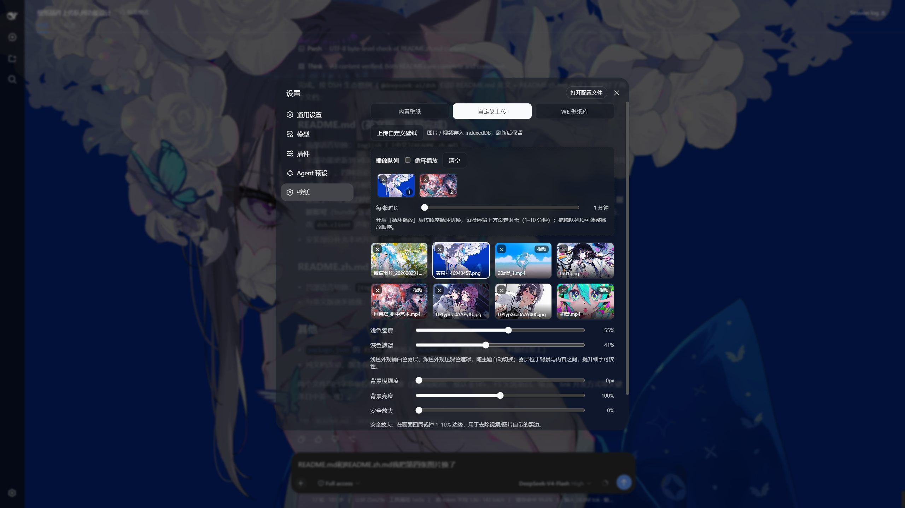
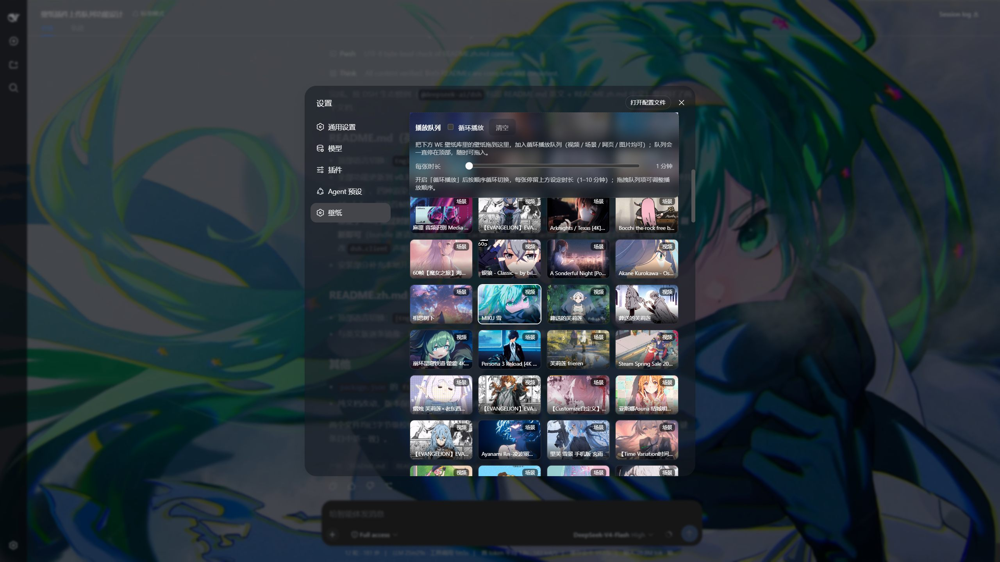

# dsh-wallpaper-bg

> v0.5.3 · MIT License

[](https://www.npmjs.com/package/dsh-wallpaper-bg)
[](https://www.npmjs.com/package/dsh-wallpaper-bg)
[](https://github.com/nishuoyang/dsh-wallpaper-bg/releases)
[](LICENSE)

[English](README.md) | 中文

给 [DeepSeek Harness](https://github.com/deepseek-ai/deepseek-harness)（DSH）界面加上一层**独立的动态壁纸背景**的静态双半插件——`dsh web` 网页界面和 0.2 **桌面端**都适用：装好（命令行一条命令；桌面端更是只在插件页面里填个包名）、刷新页面，整个界面的底层就变成一张会动的壁纸。内置 10 张 Unsplash 高清图，支持本地自定义图片 / 视频上传，还能只读接入本机 Wallpaper Engine 壁纸库——视频、网页壁纸在浏览器里原生渲染，**「同步桌面壁纸」则只读跟随当前桌面壁纸**（桌面换一张、页面对上：场景显示 WE 工坊预览图 `preview.gif`，视频 / 图片 / 网页各按原生方式渲染；不采样桌面画面、零本地渲染、零缓存文件）。浅色外观自动铺半透明白雾、深色外观自动压暗遮罩，保证界面细字始终清晰；主页面标题区还提供**「原生背景」开关**，一键清掉雾层 / 遮罩与插件的表面半透明层，让壁纸完整透出，同时保留输入框和弹窗的可读底色。背景层与桌面 Wallpaper Engine 完全独立：在 DSH 里换壁纸不会动你的桌面壁纸，反之亦然。












## 功能

- **三种壁纸来源**
  - **内置壁纸**：10 张 Unsplash 高清图，即装即用，无需任何本地服务；
  - **自定义上传**：本地图片 / 视频，存入 IndexedDB，刷新后保留。视频自动生成**首帧缩略图**，并支持按扩展名识别——浏览器 `file.type` 为空的 .mkv / .mov 等文件也能正确当视频播放，不再黑屏；
  - **WE 壁纸库**：只读接入本机 Wallpaper Engine 已安装壁纸（默认 `http://127.0.0.1:8088`），并按 Steam 真实订阅清单过滤——在 WE 里退订的壁纸不会残留。
- **播放队列（自定义上传 + WE 壁纸库）**：从对应来源的网格把壁纸拖进队列循环播放，每张停留 1–10 分钟（两个队列共用「每张时长」滑杆）；支持队列内拖拽排序（带插入指示条）、点选跳播、× 移除、清空一键重置，队列内容 / 开关 / 播放下标全部持久化到 localStorage。自定义队列支持图片 / 视频，WE 队列支持视频 / 场景 / 网页 / 图片。两个队列都**吸顶**在各自页签顶部，壁纸再多也只需短距离拖拽即可入队。
- **三种渲染**
  - 静态图片（cover 铺满）；
  - 视频（`<video object-fit: cover>`，GPU 合成缩放，无黑边无变形）；
  - 场景（一律显示 WE 自带的工坊预览图 `preview.gif` / `preview.jpg`——手选 / 队列 / 桌面同步都是同一张，`preview.gif` 本身会动；想要完整保真的动态场景，用 WE 的屏幕录制或 OBS 录成 MP4，再从「自定义上传」导入播放）；
  - 网页（web 类型壁纸 iframe 原生渲染 `index.html`，浏览器里真跑起来）。
- **零本地渲染、零缓存文件**：插件不解析 `scene.pkg`、不渲染场景帧、不烘焙视频、不采样桌面画面——不建 `~/.dsh-wallpaper-bg`、不落帧文件、不产 MP4。本地场景渲染器与烘焙整套代码在 **0.4.0 已彻底移除**，`WE_SCENE_RENDER` 开关一并删除；0.4.x 用来镜像桌面的画面捕获（`/capture`）也在 **0.5.0 移除**。
- **四项调节**：浅色雾层 / 深色遮罩（随 DSH 主题自动切换）、背景模糊度（0–20px）、背景亮度（50–150%）、安全放大（0–10%，裁掉边缘黑边）。
- **主页面原生背景开关**：一键清除浅色雾层、深色遮罩和页面表面的半透明覆盖，露出完整壁纸；输入框和弹窗保持原有可读底色。关闭后恢复原来的雾层 / 遮罩数值，开关状态会记住。
- **无黑屏切换**：换壁纸（含队列循环切图）采用双层交叉淡入淡出——新壁纸先在自己的图层里预加载、解码 / 起播完成，再与旧壁纸叠化约 0.42 秒，旧层淡出结束才移除。图片、视频、场景预览、网页各种渲染都适用，切换过程中任何一帧都有画面，不会再闪一下黑屏。
- **下一张预热**：队列循环播放时，停留期间就提前把下一张拉好（网络图片提前下载解码、WE 视频提前建好 `<video>` 元素缓冲数据、自定义上传提前读库并建好 objectURL），到点切换几乎立刻开始叠化，不再干等下载。
- **白场片头自动跳过**：部分壁纸视频本身开头是一段纯白片头（如《明日方舟》「喧闹法则」前 2 秒整帧纯白），预热时会探出正片起点并直接从那里开始播，切过去不会再看到一大片白。
- **切换不残留后台解码**：旧图层淡出时会彻底停掉抽帧定时器并释放视频（`pause()` + 断开 `src`），循环列表切多少次都只保留当前这一路解码。实测连续切换 6 次帧率稳定在 58–60 fps（修复前会从 59.7 一路掉到 12.2 fps）。
- **4K 视频不吃性能**：视频层用 `<video object-fit: cover>` 由合成器（GPU）缩放铺满，不再每帧 `drawImage` 到 canvas（4K 取一帧要 20–40ms），也去掉了 30fps 抽帧定时器；同时避免挂「恒等滤镜」（`blur(0px) brightness(100%)` 会禁用 GPU 合成）。实测 4K 壁纸从 **22–27 fps 提升到 57–60 fps**，每秒长帧从 68–72 降到 3–9。
- **页签只换视图**：切换「内置壁纸 / 自定义上传 / WE 壁纸库」只改变面板显示，**背景壁纸保持不动**——点选某张壁纸、操作播放队列或开启「同步桌面壁纸」（与 WE 队列互斥）时才真正应用。
- **同步桌面壁纸**开关：**只读跟随当前桌面壁纸**——桌面换到哪张、页面对上（30 秒轮询，切回 DSH 页签立即跟随），然后按类型正常渲染：场景显示工坊预览图（`preview.gif` / `preview.jpg`）、视频播视频、图片显示图片、网页用 iframe 原生渲染。面板显示**同步状态行**（正在跟随的壁纸标题 / 类型、跟随的显示器与判定依据、上次同步时间）并带「立即刷新」按钮。**多显示器会自动判定跟哪台**（最近换过壁纸的那台 → 正在被读取 / 播放的那台 → `Monitor0` 兜底），状态行里也能**手动指定显示器**。不修改桌面，不采样桌面画面，不产生任何缓存文件。
- WE 库内筛选：类型（全部 / 视频 / 场景 / 网页）+ 分级（非18+ / 18+，18+ 卡片带红色角标，实时显示计数）；**每次进入「WE 壁纸库」页签，分级默认回到「非18+」**。
- 设置持久化到 localStorage；界面表面自动半透明化以透出背景，可用主页面的「原生背景」开关临时完全透出。

## 安装

### 前提条件

- **DeepSeek Harness 桌面端（0.2 预览版或更新）**——不需要额外装任何东西：桌面端自带 Node.js / pnpm 运行时，**无需自装 Node**；
- **或者命令行方式**（`dsh web`）：Node.js ≥ 20（`node -v` 检查）+ 能正常启动的 DeepSeek Harness；
- 仅「WE 壁纸库」来源需要 Windows + 本机 Wallpaper Engine（可选组件，见下文）。

### 桌面端安装（无需命令行）

0.2 桌面端自带插件管理页面，装本插件完全不用开终端：

1. 打开**设置 → 插件**，在安装框里输入包名 `dsh-wallpaper-bg`；
2. 确认安装，按应用提示**重启桌面端**（或重载窗口）——插件集合在 DSH 启动时组合生效；
3. 打开**设置 → 壁纸**，挑一张壁纸即可。

桌面端会把它装进自己的 `desktop` profile，并在同一个页面里列出（可停用 / 卸载，也能看插件介绍与来源）。桌面端用固定端口（19387）提供该 profile，页面 origin 不会变，所以自定义上传（IndexedDB）和各项设置（localStorage）重启应用后都保留。

如果已把桌面端提供的 `dsh` 命令装进 PATH（应用内有该选项），等价命令是：

```bash
dsh plugin --profile desktop add dsh-wallpaper-bg
```

> `desktop` profile 归 Electron 应用独占：在终端里启动它会被拒绝（`profile "desktop" is managed exclusively by the Electron application`）。这是**预期行为**——安装 / 卸载请走插件页面（或 `dsh plugin --profile desktop …`，这条是能用的），应用启动时会自己组合并加载插件。本包自带的安装器 `dsh-wallpaper-bg install` 同样会跳过 `desktop` profile（原因相同），并提示改用插件页面。

### 命令行 / 网页版安装（`dsh web`）

```bash
dsh plugin --profile web add dsh-wallpaper-bg
```

> 本地开发建议直接链接仓库（两个 profile 都支持 link 形式）：
> `dsh plugin --profile web add link:<仓库绝对路径>`（桌面端则用 `--profile desktop`）—— 之后改 `lib/client.js` / `lib/host.js` 只需普通刷新页面即可生效，无需重启服务。
>
> Windows 下仓库路径**不能带空格**：`dsh plugin` 是经 shell 转发给 pnpm 的，带空格的 spec 会被拆成两个假依赖（`link:E:/My` + `link:Dir/plugin`），该 profile 随后直接加载失败。请把仓库放到无空格路径，或直接运行 `install-local.ps1` / `dsh-wallpaper-bg install`——它把仓库链接到 `%DSH_HOME%\node_modules`（全程无空格）并写入 profile 补丁层。

### 升级（为什么只跑 `add` 不会升级）

`dsh plugin … add` 转发给 `pnpm add`，而 pnpm 会保留 profile 清单里已有的版本范围：对已安装的插件重复执行安装命令不会产生任何变化，停在 `^0.4.1` 的 profile 永远不会自己走到 0.5.x。要升级请显式指定版本：

```bash
dsh plugin --profile web add dsh-wallpaper-bg@latest    # 升到最新发布版
dsh plugin --profile web add dsh-wallpaper-bg@0.5.3     # 或锁定某个具体版本
```

> **pnpm 11 只安装「发布满一天」的版本。** pnpm 11 默认开启 24 小时的 `minimumReleaseAge`（供应链保护）：某版本发布后约一天内，`dsh plugin … add dsh-wallpaper-bg` 只会解析到**上一个版本**，并打印 `(0.5.3 is available)`；`@latest` 同样受这个门槛限制。想立刻装上刚发布的版本，可以：写死版本号（`dsh-wallpaper-bg@0.5.3`）、加 `--config.minimumReleaseAge=0`，或在 profile 的 `pnpm-workspace.yaml` 里把本包排除：
>
> ```yaml
> minimumReleaseAgeExclude:
>   - dsh-wallpaper-bg
> ```
>
> 桌面端的插件页面走的是同一个 pnpm，所以刚发布的版本也要等约一天才会出现在那里。

### 可选组件：WE 壁纸库服务（Windows）

「WE 壁纸库」来源需要 `wallpaper-engine-api/` 服务，它把 Wallpaper Engine 已安装壁纸列表以只读 HTTP API 暴露在 `127.0.0.1:8088`：

> 该服务只随**仓库**提供，不在 npm 包里（npm tarball 只含插件本体：`lib/`、`bin/`、`cordis.patch.yml` 与文档）。从 npm 安装、又想要「WE 壁纸库」来源的用户，请 clone <https://github.com/nishuoyang/dsh-wallpaper-bg>；不需要它的话，内置壁纸与自定义上传都不受影响。插件面板的「WE 壁纸库」标签在连不上服务时也会给出同样的提示。

1. 进入 `wallpaper-engine-api/` 目录，执行 `npm install`；
2. 双击 `启动服务.bat`（首次运行会引导写入安装路径；也可用 `启动服务-静默.vbs` 静默启动）；
3. 可选：双击 `设置开机自启.bat`，把静默启动脚本注册到注册表（`HKCU\...\Run`），登录 Windows 时后台自动启动；取消请双击 `取消开机自启.bat`（脚本直接引用本目录的 `启动服务-静默.vbs`，移动过目录后请重新设置一次）；
4. 之后升级 / 重启服务一律双击 `重启服务(管理员).bat`：自动请求管理员权限、结束旧进程并静默重启，等待端口就绪（全程日志见 `restart-debug.log`）。

服务**只读**：仅调用列表 / 当前壁纸查询，绝不触碰设置或播放接口；未检测到 WE 运行时也不会拉起 WE 主程序。列表按 Steam 真实订阅清单（`431960_subscriptions.vdf`）过滤——在 WE 里退订 / 本地禁用的壁纸即使文件夹残留也不会再出现，与 WE 界面一致。

**0.5.0 起服务回归纯只读的列表 / 文件服务**：`/health`、`/api/wallpapers`、`/api/current`、`/files/<id>/...`。0.4.x 的桌面画面捕获 `GET /capture?w=&q=`（`PrintWindow(Progman, …)` 采样桌面 + `koffi` / `jpeg-js`）与 0.3.x 的本地场景渲染器（`/scene-frame`、`/scene-anim`、`lib/we-renderer/`）一样已**整体移除**——旧端点一律返回 `404`，`/health` 不再上报 `desktopCapture`，只保留 `"webShim": 1`、`"weRunning"` 与 0.5.1 起的 `"monitorSelect": 1`（当前壁纸支持指定显示器）。服务不解析 `scene.pkg`、不生成帧 / 视频、不采样桌面、不创建 `~/.dsh-wallpaper-bg`；场景壁纸由插件端显示 WE 工坊预览图（`preview.gif` / `preview.jpg`）。

> 验证：浏览器打开 `http://127.0.0.1:8088/health` 返回 JSON 即 WE 服务正常；插件侧则看 `<DSH 地址>/dsh-wallpaper-bg/health`——`dsh web` 默认端口 3080，即 `http://127.0.0.1:3080/dsh-wallpaper-bg/health`；桌面端固定 **19387**（0.2 桌面端启动 `desktop` profile 时写死 `--port 19387`），即 `http://127.0.0.1:19387/dsh-wallpaper-bg/health`。界面里同样能确认：**设置 → 插件** 里能看到 `dsh-wallpaper-bg`、**设置 → 壁纸** 能打开面板。端口 8088 是历史选择（8080 曾被 Jenkins 占用）；换端口用环境变量 `WEAPI_PORT`，并在插件设置面板里把基地址改成对应值。

## 设置面板说明

| 项 | 说明 |
| --- | --- |
| 内置壁纸 / 自定义上传 / WE 壁纸库 | 来源页签：只切换面板视图，点选某张壁纸（或操作队列 / 同步桌面）才应用背景 |
| 上传自定义壁纸 | 图片 / 视频，存入 IndexedDB；视频自动生成首帧缩略图 |
| 播放队列 | 自定义上传与 WE 壁纸库各有独立队列，吸顶在页签顶部：拖入壁纸循环播放，「每张时长」滑杆 1–10 分钟（两队列共用），队列项可拖拽排序、点选跳播、× 移除、清空 |
| WE 基地址 + 刷新 | WE API 地址（默认 `http://127.0.0.1:8088`） |
| 类型筛选 | 全部 / 视频 / 场景 / 网页，按壁纸真实类型过滤 WE 壁纸库 |
| 分级筛选 | 全部 / 非18+ / 18+（基于 project.json 的 `contentrating`：18+ = Mature + Questionable），18+ 卡片带红色角标，面板实时显示筛选计数；每次进入 WE 页签默认回到「非18+」 |
| 同步桌面壁纸 | 只读跟随当前桌面壁纸（30 秒轮询 + 切回页签立即跟随），再按类型渲染：场景 → 工坊预览图、视频 → 视频、图片 → 图片、网页 → iframe；状态行显示跟随的壁纸 / **显示器（含判定依据）** / 上次同步时间，带「立即刷新」；多显示器时出现**「跟随显示器」下拉**（自动 / 指定某台）；与 WE 队列互斥 |
| 原生背景开关 | 主页面标题区切换；开启时清除壁纸雾层 / 遮罩与页面表面半透明层，保留输入框和弹窗的可读底色；关闭时恢复原来的雾层 / 遮罩值 |
| 浅色雾层 / 深色遮罩 | 0–100%，随 DSH 主题自动切换：浅色外观铺半透明白雾垫在内容下方提升细字可读性，深色外观压黑遮罩 |
| 背景模糊度 / 背景亮度 | 0–20px / 50–150% |
| 安全放大 | 0–10%，按比例放大背景以裁掉边缘黑边 |
| 场景壁纸说明 | 一律显示 WE 自带的工坊预览图（`preview.gif` / `preview.jpg`）；不本地渲染、不采样桌面画面、无缓存文件；要 100% 保真的动态场景可用 WE 录屏 / OBS 录成 MP4 后从「自定义上传」导入 |
| 恢复默认 | 一键重置全部设置 |

## 原理

本包是 DSH **静态双半插件**，并作为 **profile 补丁层（bundle）**组合进 DSH 的 host 平面：

| 半边 | 文件 | 职责 |
| --- | --- | --- |
| 宿主半（Node） | `lib/host.js` | 注册同源路由：`/dsh-wallpaper-bg/asset`（本地文件流式代理，支持 Range）、`/dsh-wallpaper-bg/we`（WE API 只读代理，带缓存，透传 `previewFile` / `previewSize`，`action=current` 时透传「跟随显示器」的 `monitor` 并计入缓存键）、`/dsh-wallpaper-bg/health`（含 `monitorForward` 能力标记） |
| 浏览器半 | `lib/client.js` | 单文件 client bundle（`window.__ModuleLoader__` 工厂形式），注入背景层与遮罩、注册设置面板「壁纸」选项卡；「同步桌面壁纸」只读跟随桌面壁纸，再按类型走普通渲染路径（场景 → 工坊预览图） |
| 组合层 | `cordis.patch.yml` | `dsh.bundle` 补丁：把插件行插入 profile 组合的 host 平面，**随 DSH 启动即生效**（`dsh web` 与桌面端应用都一样），首次加载页面就带背景 |
两端零构建：`lib/client.js` 是手写的单文件 bundle，无需任何打包工具；另附 `dsh-wallpaper-bg` CLI（`install` / `status` / `uninstall`）完成一键安装——它面向命令行部署，会**跳过 `desktop` profile**（归 Electron 桌面端独占），桌面端请在**设置 → 插件**里安装，或用 `dsh plugin --profile desktop add dsh-wallpaper-bg`。

## 常见问题

- **桌面端怎么装？** 不用命令行：**设置 → 插件** → 输入包名 `dsh-wallpaper-bg` → 安装 → 按提示重启桌面端。装好后会出现在同一个插件页面里（可停用 / 卸载，也能看插件介绍与来源）。终端等价命令（需先装上桌面端提供的 `dsh` 命令）：`dsh plugin --profile desktop add dsh-wallpaper-bg`。
- **桌面端为什么 `dsh --profile desktop …` 报错？** 那个 profile 归 Electron 应用独占，终端启动会被拒绝：`profile "desktop" is managed exclusively by the Electron application`。这是设计如此——profile 由应用自己组合并启动。`dsh plugin --profile desktop <pnpm 参数>`（安装 / 列表 / 卸载）仍然可用，因为它只改 profile 的包清单。本包的 `dsh-wallpaper-bg install` 因此也会跳过 `desktop` 并提示走插件页面。
- **桌面端需要 Node.js 吗？需要 WE 服务吗？** Node.js 不需要——桌面端自带 Node / pnpm 运行时，只有 `dsh web` 命令行方式才要求 Node ≥ 20。可选的「WE 壁纸库」来源不受影响：仍然需要 Windows + 本机 Wallpaper Engine + 8088 端口的 `wallpaper-engine-api` 服务，和 `dsh web` 一致。
- **装完发现版本比 npm 上的旧？** 是 pnpm 11 默认的 24 小时 `minimumReleaseAge` 门槛，见上文[升级](#升级为什么只跑-add-不会升级)。想立刻装上就写死版本：`dsh plugin --profile web add dsh-wallpaper-bg@0.5.3`。
- **能装进 `headless` / `tui` / 自建 profile 吗？** 可以，而且无害：插件只在宿主的 `webServer` 服务存在时才注册路由，没有 Web 界面的 profile 会照常启动、插件静默不生效（这个修复之前，这类 profile 会直接以 `1 entry did not activate` 启动失败）。不过装在那种 profile 里没有意义——壁纸界面在浏览器页面里——请装进 `web`，或桌面端的 `desktop` profile。
- **桌面端怎么确认插件加载了？** 打开 `http://127.0.0.1:19387/dsh-wallpaper-bg/health`，返回 `{"ok":true,"plugin":"dsh-wallpaper-bg","version":"…"}` 即宿主半已挂载（0.2 桌面端固定用 19387 端口跑 `desktop` profile）。界面里也能确认：**设置 → 插件** 里列出 `dsh-wallpaper-bg`（已安装 / 已启用），**设置 → 壁纸** 能打开面板。
- **「同步桌面壁纸」显示的壁纸和我桌面上那张不一样？** 先看状态行里的**显示器**那一项：WE 的 `config.json` 把当前壁纸按显示器存成 `selectedwallpapers.Monitor0 / Monitor1 / …`，键的编号由 WE 自己维护——显示器插拔、切换主屏、笔记本内屏关掉之后，`Monitor0` 常常**不是你正在看的那台**（旧版正是盲取 `Monitor0`，于是页面一直是「以前那张」，很容易被误判成缓存没清）。0.5.1 起服务会按「最近换过壁纸的那台 → 正在被读取 / 播放的那台 → `Monitor0` 兜底」自动判定，并在状态行里写明依据（`auto：最近换过壁纸的那台` 等）；多显示器时还能在**「跟随显示器」下拉**里直接钉死某台。服务需为 **0.5.1+**（`http://127.0.0.1:8088/health` 应含 `"monitorSelect": 1`），改完记得双击 `wallpaper-engine-api/重启服务(管理员).bat` 重启服务；**下拉可用还需要重启 DSH**（透传 `monitor` 的宿主半随 DSH 启动加载，插件会在下拉旁直接提示这一点）。
- **场景类壁纸在页面上怎么显示？** 一律显示 WE 自带的工坊预览图（`preview.gif` / `preview.jpg`，WE 为每张壁纸生成的预览），**不做本地渲染、不采样桌面画面**：
  - *手动选中 / 队列 / 桌面同步*：都是同一张工坊预览图，`preview.gif` 本身会动，零文件产生；
  - *预览图很小、放大后发虚*：WE 的工坊预览图普遍只有 **192×192** 像素（状态行会实测列出，例如「实测 192×192 像素，全屏放大后必然发虚」）——这是预览图本身的尺寸，**不是缓存里的旧图、也不是没生效**；
  - *想要 100% 保真的动态场景*：用 WE 托盘菜单的屏幕录制（或 OBS）把场景录 30 秒左右导出 MP4，再通过「自定义上传」传进来——浏览器里用原生 `<video>` 播放，完整流畅、零额外开销。
- **还有本地场景渲染 / 烘焙，或者桌面画面捕获吗？** 都没有了。纯 JS 场景渲染器（`lib/we-renderer/`、`scene.pkg` 解析、shader 效果）与动画烘焙整套（`/scene-anim`、`~/.dsh-wallpaper-bg` 帧 / MP4 缓存）在 **0.4.0 已彻底移除**，`WE_SCENE_RENDER` 开关一并删除；0.4.x 用来镜像桌面的画面捕获（`/capture`，`koffi` + `jpeg-js`）在 **0.5.0 移除**。旧端点一律 `404`，服务不再写 `~/.dsh-wallpaper-bg`（历史遗留目录可直接删除）。
- **网页类壁纸（web 类型）能正常显示吗？** 能——web 壁纸本来就是 HTML/JS 网页，插件会用 iframe 全屏原生渲染 `index.html` 及其相对资源（由 WE API 的 `/files/<id>/...` 目录路由只读提供，仅限已订阅壁纸目录）。WE API 0.2.6 起还会给网页注入一层 **WE 私有接口垫片**：把 `project.json` 里的默认用户属性喂给 `applyUserProperties`（否则只在属性回调里设置背景图的壁纸会只剩角色立在纯黑底上，看起来像一张竖屏壁纸），并提供音频 / 媒体接口占位与「已画出内容」上报——插件据此在壁纸真正有画面时才叠化入场，不再黑屏或空等。注意：背景层不拦截鼠标，所以壁纸的鼠标交互（点击、拖拽）不会生效，仅视觉效果；音频可视化会以静音数据运行（浏览器里没有 WE 的音频采集）。
- **网页壁纸黑屏 / 半天不出画面？** 先确认 WE API 服务已升级到 0.2.6 并重启（`http://127.0.0.1:8088/health` 应含 `"webShim": 1`），旧版服务没有垫片，也没修 `../assets/...` 这类按 `file://` 写的相对路径。
- **网页壁纸切换时资源反复重下？** 0.3.8 已修：服务 `/files` 路由原来整读文件且返回 `no-store`，现在流式发送 + `ETag` / `Last-Modified` 条件请求（HTML `no-cache`、静态资源 300 秒缓存）并支持 `Range`。
- **视频有黑边？** 用「安全放大」拉 2–3% 即可裁掉画面自带的黑边（渲染层的 cover 裁剪已保证不自造黑边）。
- **上传的视频黑屏 / 黑色占位？** 浏览器 `file.type` 为空的视频（常见于 .mkv / .mov）现在会按扩展名识别并走视频渲染，且每个视频都会自动生成首帧缩略图；若个别文件仍是黑的，多半是该编码浏览器不支持。
- **改了代码不生效？** 分两半看：只改 `lib/client.js`（浏览器半）时**普通刷新页面（F5）即可**——客户端 bundle 每次请求都从磁盘现读（`cache-control: no-cache`）；改 `lib/host.js`（宿主半）或 `bin/` 之后**必须重启 DSH**（宿主半是 Node 侧 ESM 模块，随进程启动加载、进程内不会重新导入）——`dsh web` 重启进程，桌面端退出应用再打开。增删插件行 / 修改 `dsh.client` 声明等插件集合变化同样需要重启。判断当前跑的是哪版宿主半：打开 `<DSH 地址>/dsh-wallpaper-bg/health` 看 `version`（桌面端固定 19387 端口）。
- **WE 壁纸库报错？** 确认 `wallpaper-engine-api` 服务在 8088 端口运行（浏览器访问 `http://127.0.0.1:8088/health` 验证），且插件设置里的基地址一致。
- **在 WE 里删掉的壁纸还在插件里？** 服务会按 Steam 订阅清单过滤，退订的壁纸不再列出；若服务还是旧版本（`/health` 没有 `subscriptionsFile` 字段），双击 `重启服务(管理员).bat` 升级，然后点插件里的「刷新」。

## 开源

MIT License，见 [LICENSE](LICENSE)。欢迎 issue / PR。

### 发布流程

仓库自带一键发布脚本 `scripts/release.ps1`，固化「版本校验 → 打包预检 → 提交 → 打标签 → 推送 → npm publish → GitHub Release（附 tarball）」：

```powershell
.\scripts\release.ps1 -DryRun              # 先预演：只检查不产生改动
.\scripts\release.ps1 -Version x.y.z       # 改版本号并发布
.\scripts\release.ps1                      # 发布 package.json 里的当前版本
.\scripts\release.ps1 -Resume              # 上次中断后续跑
```

预检会拒绝重复发布（本地 / 远端已有标签、npm 上已有该版本），并校验 `CHANGELOG.md` 已写好对应版本条目——Release 说明直接取自该条目。另有 `-SkipNpm` / `-SkipGitHub` / `-SkipPush` / `-Yes` 可选。

`npm publish` 成功后注册表要几分钟才可见（npm 自己会提示 "may take a few minutes"），所以脚本会轮询等待（`-NpmWaitSeconds`，默认 300 秒）而不是查一次就中断；等不到也只警告并继续发 GitHub Release，且 GitHub Release 这一步是幂等的（已存在就补传附件）。万一流程还是中断了，用 `-Resume` 续跑：它要求工作区干净、标签指向 HEAD，跳过已经成功的步骤（提交 / 打标签 / 推送 / 发布）只补剩下的。

### CI 工作流（npm provenance / GitHub Packages 镜像）

`.github/workflows/` 下另有两个工作流，都是**手动 / 按需触发**，用来把 npm 与 GitHub 两侧的关联做实：

| 工作流 | 文件 | 触发 | 作用 |
| --- | --- | --- | --- |
| Publish to npm | `publish-npm.yml` | 手动（`workflow_dispatch`） | 用仓库的 OIDC 身份发布到 npmjs，npm 会自动附带 **provenance** 证明：包页面出现 "Built and signed on GitHub Actions" 徽章，点开直达本仓库 / commit |
| Mirror to GitHub Packages | `publish-github-packages.yml` | GitHub Release 发布后，或手动 | 以 `@nishuoyang/dsh-wallpaper-bg` 之名镜像发一份到 `npm.pkg.github.com`，让仓库右侧的 **Packages** 区块真正列出本包 |

用 `publish-npm.yml` 之前，需要在 npmjs.com 上配一次 trusted publisher（包页面 → Settings → Trusted Publisher → GitHub Actions：`nishuoyang` / `dsh-wallpaper-bg` / `publish-npm.yml`）。配好之后**不需要任何 token**（没有 `NPM_TOKEN` 也不用轮换；想走 token 方式则加一个同名仓库 secret，见工作流文件里的注释）。它默认只手动触发，是为了绝不与 `release.ps1` 的本地 `npm publish` 抢同一个版本号；想把发布完全搬到 CI，就先 `.\scripts\release.ps1 -SkipNpm` 让本地跳过，再启用工作流里的 `push.tags` 触发。

镜像工作流用自带的 `GITHUB_TOKEN` 发布；首次发布默认可见性是 private，可在包设置里改成 public。注意 GitHub Packages 的 npm 源**即使包是 public，install 时也必须带 token**——所以对外安装始终走 npmjs（`dsh plugin add dsh-wallpaper-bg`，或桌面端插件页里填包名），镜像只为 GitHub 侧展示。

`legacy/` 目录存放 v0.1.0 之前的动态插件（Cordis dynamic package）时代源码，仅作归档。
